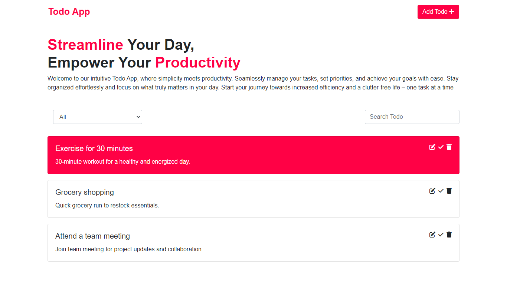

# Todo App



## About

This Todo app is a simple and intuitive task management tool designed to help you stay organized and productive.

## Features

- **Add and Edit Tasks:** Easily create new tasks and edit existing ones.
- **Complete Tasks:** Mark tasks as completed to track your progress.
- **Filter and Search:** Use filters to view incomplete or completed tasks. Search for specific tasks.
- **Local Storage:** Your tasks are stored locally, ensuring persistence between sessions.
- **Responsive Design:** Access and manage your tasks seamlessly on different devices.

## Getting Started

1. Clone the repository.
   ```bash
   git clone https://github.com/your-username/todo-app.git
